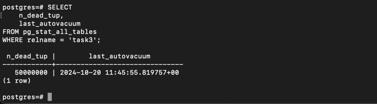
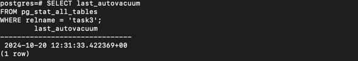
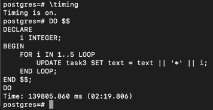
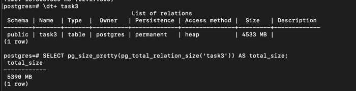
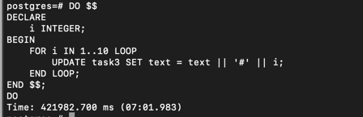
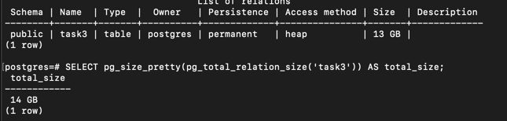

1. Создать таблицу с текстовым полем и заполнить случайными или сгенерированными данным в размере 1 млн строк

2. Посмотреть размер файла с таблицей

3. 5 раз обновить все строчки и добавить к каждой строчке любой символ
   

4. Посмотреть количество мертвых строчек в таблице и когда последний раз приходил
   автовакуум
   

5. Подождать некоторое время, проверяя, пришел ли автовакуум
   

6. 5 раз обновить все строчки и добавить к каждой строчке любой символ
   
7. Посмотреть размер файла с таблицей
   
8. Отключить Автовакуум на конкретной таблице

9. 10 раз обновить все строчки и добавить к каждой строчке любой символ
   
10. Посмотреть размер файла с таблицей
    
11. Объясните полученный результат
   таблица занимает все больше и больше места с каждым update поскольку MVCC предполагает не собственно изменение существующей записи,
   а появление новой. Вакуум их потом пометит старые, с тем чтобы поверх них записывались новые записи, но пока они просто занимают место  
12. Не забудьте включить автовакуум)
