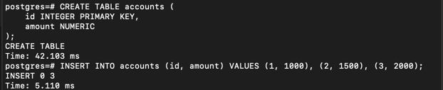
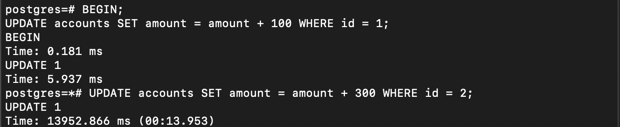
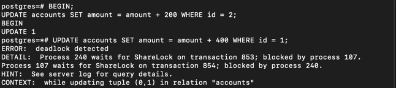
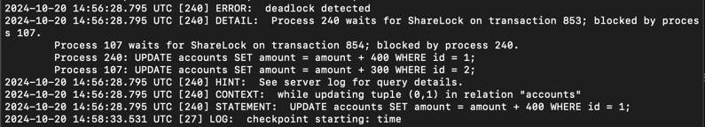

1. Создать таблицу accounts(id integer, amount numeric);
   

2. Добавить несколько записей и подключившись через 2 терминала добиться ситуации взаимоблокировки (deadlock).
   

   

4. Посмотреть логи и убедиться, что информация о дедлоке туда попала.

